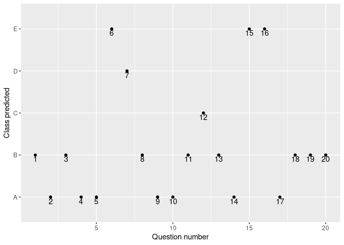

Introduction
------------

Using devices such as Jawbone Up, Nike FuelBand, and Fitbit it is now
possible to collect a large amount of data about personal activity
relatively inexpensively. These type of devices are part of the
**quantified self movement** – a group of enthusiasts who take
measurements about themselves regularly to improve their health, to find
patterns in their behavior, or because they are tech geeks. One thing
that people regularly do is quantify how much of a particular activity
they do, but they rarely quantify *how well* they do it. In this
project, the goal will be to use data from accelerometers on the belt,
forearm, arm, and dumbell of 6 participants. They were asked to perform
barbell lifts correctly and incorrectly in 5 different ways. More
information is available from the website
[here](http://web.archive.org/web/20161224072740/http:/groupware.les.inf.puc-rio.br/har)
(see the section on the Weight Lifting Exercise Dataset).

Preliminaries
-------------

In this section I will require the libraries for plotting and
prediction.

    require(caret);require(ggplot2);require(randomForest)

Data
----

### Training and Testing

    url <- 'https://d396qusza40orc.cloudfront.net/predmachlearn/pml-training.csv'
    if(!(file.exists('training.csv'))) download.file(url,'training.csv')
    training <- read.csv('training.csv')

### Validation

**Remark: even though this is defined as a testing set, it must not be
mistaken for the testing I will use. This is provided to answer the
questions, for validation, hence the variable name.**

    url <- 'https://d396qusza40orc.cloudfront.net/predmachlearn/pml-testing.csv'
    if(!(file.exists('validation.csv'))) download.file(url,'validation.csv')
    validation <- read.csv('validation.csv')

Before moving forward, I want to thank [these
guys](http://web.archive.org/web/20161224072740/http:/groupware.les.inf.puc-rio.br/har)
for providing such data.

Preprocessing
-------------

First, let’s look at the `training` dataset, in order to remove some
useless variables (in terms of prediction).

    str(training)

    ## 'data.frame':    19622 obs. of  160 variables:
    ##  $ X                       : int  1 2 3 4 5 6 7 8 9 10 ...
    ##  $ user_name               : chr  "carlitos" "carlitos" "carlitos" "carlitos" ...
    ##  $ raw_timestamp_part_1    : int  1323084231 1323084231 1323084231 1323084232 1323084232 1323084232 1323084232 1323084232 1323084232 1323084232 ...
    ##  $ raw_timestamp_part_2    : int  788290 808298 820366 120339 196328 304277 368296 440390 484323 484434 ...
    ##  $ cvtd_timestamp          : chr  "05/12/2011 11:23" "05/12/2011 11:23" "05/12/2011 11:23" "05/12/2011 11:23" ...
    ##  $ new_window              : chr  "no" "no" "no" "no" ...
    ##  $ num_window              : int  11 11 11 12 12 12 12 12 12 12 ...
    ##  $ roll_belt               : num  1.41 1.41 1.42 1.48 1.48 1.45 1.42 1.42 1.43 1.45 ...
    ##  $ pitch_belt              : num  8.07 8.07 8.07 8.05 8.07 8.06 8.09 8.13 8.16 8.17 ...
    ##  $ yaw_belt                : num  -94.4 -94.4 -94.4 -94.4 -94.4 -94.4 -94.4 -94.4 -94.4 -94.4 ...
    ##  $ total_accel_belt        : int  3 3 3 3 3 3 3 3 3 3 ...
    ##  $ kurtosis_roll_belt      : chr  "" "" "" "" ...
    ##  $ kurtosis_picth_belt     : chr  "" "" "" "" ...
    ##  $ kurtosis_yaw_belt       : chr  "" "" "" "" ...
    ##  $ skewness_roll_belt      : chr  "" "" "" "" ...
    ##  $ skewness_roll_belt.1    : chr  "" "" "" "" ...
    ##  $ skewness_yaw_belt       : chr  "" "" "" "" ...
    ##  $ max_roll_belt           : num  NA NA NA NA NA NA NA NA NA NA ...
    ##  $ max_picth_belt          : int  NA NA NA NA NA NA NA NA NA NA ...
    ##  $ max_yaw_belt            : chr  "" "" "" "" ...
    ##  $ min_roll_belt           : num  NA NA NA NA NA NA NA NA NA NA ...
    ##  $ min_pitch_belt          : int  NA NA NA NA NA NA NA NA NA NA ...
    ##  $ min_yaw_belt            : chr  "" "" "" "" ...
    ##  $ amplitude_roll_belt     : num  NA NA NA NA NA NA NA NA NA NA ...
    ##  $ amplitude_pitch_belt    : int  NA NA NA NA NA NA NA NA NA NA ...
    ##  $ amplitude_yaw_belt      : chr  "" "" "" "" ...
    ##  $ var_total_accel_belt    : num  NA NA NA NA NA NA NA NA NA NA ...
    ##  $ avg_roll_belt           : num  NA NA NA NA NA NA NA NA NA NA ...
    ##  $ stddev_roll_belt        : num  NA NA NA NA NA NA NA NA NA NA ...
    ##  $ var_roll_belt           : num  NA NA NA NA NA NA NA NA NA NA ...
    ##  $ avg_pitch_belt          : num  NA NA NA NA NA NA NA NA NA NA ...
    ##  $ stddev_pitch_belt       : num  NA NA NA NA NA NA NA NA NA NA ...
    ##  $ var_pitch_belt          : num  NA NA NA NA NA NA NA NA NA NA ...
    ##  $ avg_yaw_belt            : num  NA NA NA NA NA NA NA NA NA NA ...
    ##  $ stddev_yaw_belt         : num  NA NA NA NA NA NA NA NA NA NA ...
    ##  $ var_yaw_belt            : num  NA NA NA NA NA NA NA NA NA NA ...
    ##  $ gyros_belt_x            : num  0 0.02 0 0.02 0.02 0.02 0.02 0.02 0.02 0.03 ...
    ##  $ gyros_belt_y            : num  0 0 0 0 0.02 0 0 0 0 0 ...
    ##  $ gyros_belt_z            : num  -0.02 -0.02 -0.02 -0.03 -0.02 -0.02 -0.02 -0.02 -0.02 0 ...
    ##  $ accel_belt_x            : int  -21 -22 -20 -22 -21 -21 -22 -22 -20 -21 ...
    ##  $ accel_belt_y            : int  4 4 5 3 2 4 3 4 2 4 ...
    ##  $ accel_belt_z            : int  22 22 23 21 24 21 21 21 24 22 ...
    ##  $ magnet_belt_x           : int  -3 -7 -2 -6 -6 0 -4 -2 1 -3 ...
    ##  $ magnet_belt_y           : int  599 608 600 604 600 603 599 603 602 609 ...
    ##  $ magnet_belt_z           : int  -313 -311 -305 -310 -302 -312 -311 -313 -312 -308 ...
    ##  $ roll_arm                : num  -128 -128 -128 -128 -128 -128 -128 -128 -128 -128 ...
    ##  $ pitch_arm               : num  22.5 22.5 22.5 22.1 22.1 22 21.9 21.8 21.7 21.6 ...
    ##  $ yaw_arm                 : num  -161 -161 -161 -161 -161 -161 -161 -161 -161 -161 ...
    ##  $ total_accel_arm         : int  34 34 34 34 34 34 34 34 34 34 ...
    ##  $ var_accel_arm           : num  NA NA NA NA NA NA NA NA NA NA ...
    ##  $ avg_roll_arm            : num  NA NA NA NA NA NA NA NA NA NA ...
    ##  $ stddev_roll_arm         : num  NA NA NA NA NA NA NA NA NA NA ...
    ##  $ var_roll_arm            : num  NA NA NA NA NA NA NA NA NA NA ...
    ##  $ avg_pitch_arm           : num  NA NA NA NA NA NA NA NA NA NA ...
    ##  $ stddev_pitch_arm        : num  NA NA NA NA NA NA NA NA NA NA ...
    ##  $ var_pitch_arm           : num  NA NA NA NA NA NA NA NA NA NA ...
    ##  $ avg_yaw_arm             : num  NA NA NA NA NA NA NA NA NA NA ...
    ##  $ stddev_yaw_arm          : num  NA NA NA NA NA NA NA NA NA NA ...
    ##  $ var_yaw_arm             : num  NA NA NA NA NA NA NA NA NA NA ...
    ##  $ gyros_arm_x             : num  0 0.02 0.02 0.02 0 0.02 0 0.02 0.02 0.02 ...
    ##  $ gyros_arm_y             : num  0 -0.02 -0.02 -0.03 -0.03 -0.03 -0.03 -0.02 -0.03 -0.03 ...
    ##  $ gyros_arm_z             : num  -0.02 -0.02 -0.02 0.02 0 0 0 0 -0.02 -0.02 ...
    ##  $ accel_arm_x             : int  -288 -290 -289 -289 -289 -289 -289 -289 -288 -288 ...
    ##  $ accel_arm_y             : int  109 110 110 111 111 111 111 111 109 110 ...
    ##  $ accel_arm_z             : int  -123 -125 -126 -123 -123 -122 -125 -124 -122 -124 ...
    ##  $ magnet_arm_x            : int  -368 -369 -368 -372 -374 -369 -373 -372 -369 -376 ...
    ##  $ magnet_arm_y            : int  337 337 344 344 337 342 336 338 341 334 ...
    ##  $ magnet_arm_z            : int  516 513 513 512 506 513 509 510 518 516 ...
    ##  $ kurtosis_roll_arm       : chr  "" "" "" "" ...
    ##  $ kurtosis_picth_arm      : chr  "" "" "" "" ...
    ##  $ kurtosis_yaw_arm        : chr  "" "" "" "" ...
    ##  $ skewness_roll_arm       : chr  "" "" "" "" ...
    ##  $ skewness_pitch_arm      : chr  "" "" "" "" ...
    ##  $ skewness_yaw_arm        : chr  "" "" "" "" ...
    ##  $ max_roll_arm            : num  NA NA NA NA NA NA NA NA NA NA ...
    ##  $ max_picth_arm           : num  NA NA NA NA NA NA NA NA NA NA ...
    ##  $ max_yaw_arm             : int  NA NA NA NA NA NA NA NA NA NA ...
    ##  $ min_roll_arm            : num  NA NA NA NA NA NA NA NA NA NA ...
    ##  $ min_pitch_arm           : num  NA NA NA NA NA NA NA NA NA NA ...
    ##  $ min_yaw_arm             : int  NA NA NA NA NA NA NA NA NA NA ...
    ##  $ amplitude_roll_arm      : num  NA NA NA NA NA NA NA NA NA NA ...
    ##  $ amplitude_pitch_arm     : num  NA NA NA NA NA NA NA NA NA NA ...
    ##  $ amplitude_yaw_arm       : int  NA NA NA NA NA NA NA NA NA NA ...
    ##  $ roll_dumbbell           : num  13.1 13.1 12.9 13.4 13.4 ...
    ##  $ pitch_dumbbell          : num  -70.5 -70.6 -70.3 -70.4 -70.4 ...
    ##  $ yaw_dumbbell            : num  -84.9 -84.7 -85.1 -84.9 -84.9 ...
    ##  $ kurtosis_roll_dumbbell  : chr  "" "" "" "" ...
    ##  $ kurtosis_picth_dumbbell : chr  "" "" "" "" ...
    ##  $ kurtosis_yaw_dumbbell   : chr  "" "" "" "" ...
    ##  $ skewness_roll_dumbbell  : chr  "" "" "" "" ...
    ##  $ skewness_pitch_dumbbell : chr  "" "" "" "" ...
    ##  $ skewness_yaw_dumbbell   : chr  "" "" "" "" ...
    ##  $ max_roll_dumbbell       : num  NA NA NA NA NA NA NA NA NA NA ...
    ##  $ max_picth_dumbbell      : num  NA NA NA NA NA NA NA NA NA NA ...
    ##  $ max_yaw_dumbbell        : chr  "" "" "" "" ...
    ##  $ min_roll_dumbbell       : num  NA NA NA NA NA NA NA NA NA NA ...
    ##  $ min_pitch_dumbbell      : num  NA NA NA NA NA NA NA NA NA NA ...
    ##  $ min_yaw_dumbbell        : chr  "" "" "" "" ...
    ##  $ amplitude_roll_dumbbell : num  NA NA NA NA NA NA NA NA NA NA ...
    ##   [list output truncated]

The first 5 variables have clearly nothing to do with movement, so they
will not be good predictors in this case.

    training <- training[, 6:ncol(training)]

The next natural steps are to split the `training` dataset into **60%
training and 40% testing**.

    inTrain <- createDataPartition(y = training$classe, p = 0.6, list = FALSE)
    training <- training[inTrain, ]
    testing <- training[-inTrain, ] # This will be the actual testing

Now let’s remove, as seen during lessons, the predictors with near zero
variance.

    nzv <- nearZeroVar(training, saveMetrics = TRUE)
    featuresToKeep <- row.names(nzv[nzv$nzv == FALSE, ])
    training <- training[, featuresToKeep]

Finally, the variables filled with *NAs* are not useful and can be
removed.

    training <- training[, colSums(is.na(training)) == 0]

The residual dataset has 54 variables left.

Model training
--------------

Due to the nature of the problem, predicting with regression would not
make much sense. Instead, I’ll choose a tree approach. For training, I
set up a 6-fold cross validation like so:

    modelControl <- trainControl(method = 'cv', number = 6)

First I fit a model with **random forest** algorithm.

    modelRF <- train(classe ~ ., data = training, method = 'rf', trControl = modelControl)
    modelRF$finalModel

    ## 
    ## Call:
    ##  randomForest(x = x, y = y, mtry = param$mtry) 
    ##                Type of random forest: classification
    ##                      Number of trees: 500
    ## No. of variables tried at each split: 27
    ## 
    ##         OOB estimate of  error rate: 0.2%
    ## Confusion matrix:
    ##      A    B    C    D    E class.error
    ## A 3348    0    0    0    0 0.000000000
    ## B    8 2268    3    0    0 0.004826678
    ## C    0    3 2051    0    0 0.001460565
    ## D    0    0    5 1925    0 0.002590674
    ## E    0    0    0    4 2161 0.001847575

Then with **gradient boosting method**.

    modelGBM <- train(classe ~ ., data = training, method = 'gbm', verbose = FALSE, trControl = modelControl)
    modelGBM$finalModel

    ## A gradient boosted model with multinomial loss function.
    ## 150 iterations were performed.
    ## There were 53 predictors of which 53 had non-zero influence.

And, finally, **linear discriminant analysis**.

    modelLDA <- train(classe ~ ., data = training, method = 'lda', trControl = modelControl)
    modelLDA$finalModel

    ## Call:
    ## lda(x, grouping = y)
    ## 
    ## Prior probabilities of groups:
    ##         A         B         C         D         E 
    ## 0.2843071 0.1935292 0.1744226 0.1638927 0.1838485 
    ## 
    ## Group means:
    ##   num_window roll_belt pitch_belt   yaw_belt total_accel_belt gyros_belt_x
    ## A   382.9701  59.81393  0.3864755 -11.602431         10.72611 -0.009005376
    ## B   499.0974  63.79760  0.2650636 -14.918333         10.95875 -0.006107942
    ## C   485.6407  65.96982 -1.2424732  -5.694338         11.30477 -0.015418695
    ## D   428.9093  60.54778  2.1032850 -18.944855         11.20104 -0.012160622
    ## E   374.3718  73.86097  0.6472702  -6.318023         12.55935  0.013796767
    ##   gyros_belt_y gyros_belt_z accel_belt_x accel_belt_y accel_belt_z
    ## A   0.04010454   -0.1239188    -6.280466     29.13769    -63.52688
    ## B   0.04132514   -0.1336244    -5.319000     31.38175    -71.57174
    ## C   0.04041870   -0.1362804    -3.757059     31.60029    -72.97420
    ## D   0.03354404   -0.1443212    -8.694819     30.48135    -68.75337
    ## E   0.03846651   -0.1247991    -4.636952     29.03695    -90.45774
    ##   magnet_belt_x magnet_belt_y magnet_belt_z  roll_arm  pitch_arm    yaw_arm
    ## A      57.61858      601.7942     -338.3925 -1.492389   3.594474 -10.871207
    ## B      47.95568      599.0829     -337.0706 32.907995  -7.821272  10.021496
    ## C      57.91042      599.3218     -338.3885 24.151022  -2.679041   3.756081
    ## D      48.12746      594.2689     -340.9435 22.164591  -9.931259   4.608751
    ## E      63.50808      568.6430     -378.2171 20.578827 -12.726189  -2.473058
    ##   total_accel_arm  gyros_arm_x gyros_arm_y gyros_arm_z accel_arm_x accel_arm_y
    ## A        27.24731 -0.003064516  -0.2070789   0.2578614  -132.58453    47.10633
    ## B        26.86529 -0.005383940  -0.2628346   0.2495700   -39.91970    25.89688
    ## C        24.26826  0.139756573  -0.2870740   0.2794839   -72.40166    38.13583
    ## D        23.42073 -0.004901554  -0.2362280   0.2528601    13.91347    25.30000
    ## E        24.81293  0.074983834  -0.2931224   0.2784942   -17.72517    14.54273
    ##   accel_arm_z magnet_arm_x magnet_arm_y magnet_arm_z roll_dumbbell
    ## A   -72.74701    -21.59319    236.35305     415.5209      20.63041
    ## B   -99.82580    236.22993    126.02852     185.1865      35.03655
    ## C   -54.04528    169.50633    184.27605     356.1368     -13.87806
    ## D   -48.19793    393.28446     97.10466     298.9332      50.37601
    ## E   -82.75566    326.54134     78.25866     204.6651      24.97579
    ##   pitch_dumbbell yaw_dumbbell total_accel_dumbbell gyros_dumbbell_x
    ## A     -18.625249     1.756047             14.50060        0.1699612
    ## B       4.035611    16.042843             14.20140        0.1642343
    ## C     -24.747976   -16.482140             12.78335        0.1932668
    ## D      -2.354494     1.935294             11.33990        0.1965285
    ## E      -7.520369     6.126844             14.18707        0.1199307
    ##   gyros_dumbbell_y gyros_dumbbell_z accel_dumbbell_x accel_dumbbell_y
    ## A       0.02039725       -0.1532885      -49.3440860         51.42085
    ## B       0.01401053       -0.1339667        0.8319438         67.78455
    ## C       0.05054041       -0.1531840      -39.2336904         29.74099
    ## D       0.01438860       -0.1248238      -22.9036269         53.08187
    ## E       0.13483141       -0.1375751      -19.1524249         53.27806
    ##   accel_dumbbell_z magnet_dumbbell_x magnet_dumbbell_y magnet_dumbbell_z
    ## A        -56.10006         -381.4519          212.7754          10.42563
    ## B        -13.61079         -249.1422          265.4247          50.02589
    ## C        -51.55696         -368.4202          158.2678          63.81986
    ## D        -33.50622         -317.4228          220.2430          57.18083
    ## E        -24.29515         -300.0453          240.2818          71.76212
    ##   roll_forearm pitch_forearm yaw_forearm total_accel_forearm gyros_forearm_x
    ## A     26.10084     -6.254576   25.393671            32.08124       0.1865233
    ## B     31.51110     15.355086   11.010812            35.13164       0.1202896
    ## C     58.32755     12.135550   38.412683            34.87731       0.2074051
    ## D     16.29181     28.328093    4.528663            36.15596       0.1242746
    ## E     40.02605     16.784873   11.084471            36.77552       0.1210254
    ##   gyros_forearm_y gyros_forearm_z accel_forearm_x accel_forearm_y
    ## A    0.0190979689       0.1071595      -0.8799283        169.1714
    ## B    0.1142299254       0.1757130     -73.6156209        138.5169
    ## C    0.0575073028       0.1482571     -50.5696203        212.1573
    ## D    0.0003056995       0.1148446    -155.5419689        153.5078
    ## E    0.1267667436       0.1661986     -74.8877598        141.4965
    ##   accel_forearm_z magnet_forearm_x magnet_forearm_y magnet_forearm_z
    ## A       -59.80585        -195.9131         468.2584         403.0980
    ## B       -46.85827        -325.9223         288.7516         373.8197
    ## C       -57.28432        -335.2775         502.0964         456.5779
    ## D       -48.29326        -462.0819         324.5155         363.5689
    ## E       -57.99769        -334.3714         274.8896         350.1390
    ## 
    ## Coefficients of linear discriminants:
    ##                                LD1           LD2           LD3           LD4
    ## num_window            0.0003833207 -0.0006039475  1.550018e-03  0.0001430359
    ## roll_belt             0.0584970052  0.1013145969 -3.300323e-04  0.0699577920
    ## pitch_belt            0.0361664764  0.0127390317 -7.515928e-02  0.0028452197
    ## yaw_belt             -0.0093415177  0.0011591324 -1.003452e-02 -0.0040145500
    ## total_accel_belt     -0.0331406764 -0.0177587927 -2.797019e-01 -0.1869952612
    ## gyros_belt_x          0.8715252390  0.0327725218  8.775043e-01  0.4961861995
    ## gyros_belt_y         -1.5661439398 -2.0079383092 -1.155761e+00  1.1541756195
    ## gyros_belt_z          0.6140005393  0.6125817686  5.061538e-01 -0.5401473012
    ## accel_belt_x         -0.0031361333 -0.0007530293  1.955266e-02  0.0016335526
    ## accel_belt_y         -0.0231468780 -0.0362267041  5.624731e-02  0.0084142810
    ## accel_belt_z          0.0057137489  0.0313173151 -1.040300e-02  0.0148962376
    ## magnet_belt_x        -0.0112267966  0.0042764078 -2.136664e-02 -0.0046176968
    ## magnet_belt_y        -0.0219625651 -0.0072413105 -1.738398e-03 -0.0044263903
    ## magnet_belt_z         0.0075109900 -0.0011092015  1.213482e-02  0.0037573407
    ## roll_arm              0.0010771081  0.0004627633  2.010965e-03  0.0004918239
    ## pitch_arm            -0.0025163863  0.0053591976  4.514416e-03  0.0012130172
    ## yaw_arm               0.0012739603 -0.0008491664  1.712881e-03 -0.0014523412
    ## total_accel_arm       0.0058748928 -0.0226713370 -1.906137e-02 -0.0177255901
    ## gyros_arm_x           0.1300622452  0.0265714392 -5.717462e-02  0.0298302342
    ## gyros_arm_y           0.0804462105 -0.0571974323 -8.094269e-02  0.1379706143
    ## gyros_arm_z          -0.1519185341 -0.1176812967 -4.252242e-02  0.1404711761
    ## accel_arm_x          -0.0032039938 -0.0045231482 -7.482551e-03 -0.0021739548
    ## accel_arm_y          -0.0036296453  0.0144789124 -1.015588e-03  0.0037146955
    ## accel_arm_z           0.0100460889 -0.0017309376  2.544862e-03 -0.0070774681
    ## magnet_arm_x          0.0001850783 -0.0004052367  1.857900e-03  0.0012737543
    ## magnet_arm_y         -0.0010013102 -0.0049716529  5.382637e-03  0.0006510343
    ## magnet_arm_z         -0.0038951486 -0.0022419965 -5.732187e-03  0.0019230820
    ## roll_dumbbell         0.0027114778 -0.0038406619 -2.913973e-03 -0.0076700788
    ## pitch_dumbbell       -0.0051769003 -0.0034965003 -3.665886e-03 -0.0050996372
    ## yaw_dumbbell         -0.0075943193  0.0068796642 -3.580096e-03 -0.0038583254
    ## total_accel_dumbbell  0.0722685122  0.0664565987  7.421834e-03  0.0043833214
    ## gyros_dumbbell_x      0.2904101424 -0.4613584154  2.158122e-01  0.0809068916
    ## gyros_dumbbell_y      0.2082178272 -0.2494494120 -1.329547e-02  0.2384052275
    ## gyros_dumbbell_z      0.2428728368 -0.3028591230 -1.043593e-02 -0.0233149696
    ## accel_dumbbell_x      0.0130486903  0.0088484466  1.685272e-03  0.0070373296
    ## accel_dumbbell_y      0.0022111498  0.0021782523  2.424614e-03 -0.0013931922
    ## accel_dumbbell_z      0.0022981819  0.0024729091  2.618861e-03  0.0013593729
    ## magnet_dumbbell_x    -0.0043999981 -0.0002260646  3.154020e-03 -0.0024832547
    ## magnet_dumbbell_y    -0.0013028503  0.0026110240 -6.027695e-04 -0.0024375431
    ## magnet_dumbbell_z     0.0136025863 -0.0102596297 -1.715812e-03  0.0093070603
    ## roll_forearm          0.0015751268  0.0014484745  1.228504e-04  0.0012278785
    ## pitch_forearm         0.0158276312 -0.0120601243  6.102856e-03 -0.0010765054
    ## yaw_forearm          -0.0003013676  0.0007707670  4.831655e-04  0.0012290938
    ## total_accel_forearm   0.0315500784  0.0088033825 -8.362753e-03  0.0006115268
    ## gyros_forearm_x       0.0182862502 -0.1146843621  1.312064e-01  0.1488759817
    ## gyros_forearm_y       0.0029560023 -0.0402203339  1.265032e-02  0.0003255845
    ## gyros_forearm_z       0.0892841613  0.1293410564 -7.852098e-02 -0.0085593369
    ## accel_forearm_x       0.0031852187  0.0111228564  8.077418e-05  0.0036285080
    ## accel_forearm_y       0.0010613698 -0.0008826784 -8.116930e-04 -0.0021120738
    ## accel_forearm_z      -0.0073745208  0.0026273476  3.828866e-03 -0.0041877673
    ## magnet_forearm_x     -0.0017391775 -0.0036317455  1.889440e-04 -0.0011154707
    ## magnet_forearm_y     -0.0009741505 -0.0015460454  5.160757e-04  0.0003479038
    ## magnet_forearm_z     -0.0001329343 -0.0015430944 -3.642273e-04  0.0011399963
    ## 
    ## Proportion of trace:
    ##    LD1    LD2    LD3    LD4 
    ## 0.4774 0.2456 0.1699 0.1071

Prediction
----------

This is where the *validation* (the provided `testing`) set will be
used.

### Prediction with Random Forest

    predictionRF <- predict(modelRF, newdata = testing)
    confusionMatrix(predictionRF, factor(testing$classe))$overall[1]

    ## Accuracy 
    ##        1

    table(predictionRF, testing$classe)

    ##             
    ## predictionRF    A    B    C    D    E
    ##            A 1322    0    0    0    0
    ##            B    0  932    0    0    0
    ##            C    0    0  802    0    0
    ##            D    0    0    0  794    0
    ##            E    0    0    0    0  880

### Prediction with Gradient Boost Method

    predictionGBM <- predict(modelGBM, newdata = testing)
    confusionMatrix(predictionGBM, factor(testing$classe))$overall[1]

    ##  Accuracy 
    ## 0.9940803

    table(predictionGBM, testing$classe)

    ##              
    ## predictionGBM    A    B    C    D    E
    ##             A 1322    4    0    1    0
    ##             B    0  922    3    0    1
    ##             C    0    5  798    8    2
    ##             D    0    1    1  785    2
    ##             E    0    0    0    0  875

### Prediction with Linear Discriminant Analysis

    predictionLDA <- predict(modelLDA, newdata = testing)
    confusionMatrix(predictionLDA, factor(testing$classe))$overall[1]

    ##  Accuracy 
    ## 0.7274841

    table(predictionLDA, testing$classe)

    ##              
    ## predictionLDA    A    B    C    D    E
    ##             A 1111  138   68   45   31
    ##             B   43  623   78   33  126
    ##             C   80  105  558   96   81
    ##             D   83   33   79  592   85
    ##             E    5   33   19   28  557

From the accuracies, it appears clear that LDA performs pretty poorly,
compared to the other two methods; also, for the problem at hand,
**random forest has a better accuracy** (even though it has WAY worse
computation time).

Final test on validation set
----------------------------

As mentioned, I will perform it using the most accurate method, which is
random forest.

    predictionForValidation <- predict(modelRF, newdata = validation)

Hence, the prediction graph on the given validation set.

    qplot(x = 1:20, y = predictionForValidation) + geom_text(nudge_y = -0.1, aes(label = 1:20)) + xlab('Question number') + ylab('Class predicted')

*Final remark: using gradient boosting would have also given good
results.*
